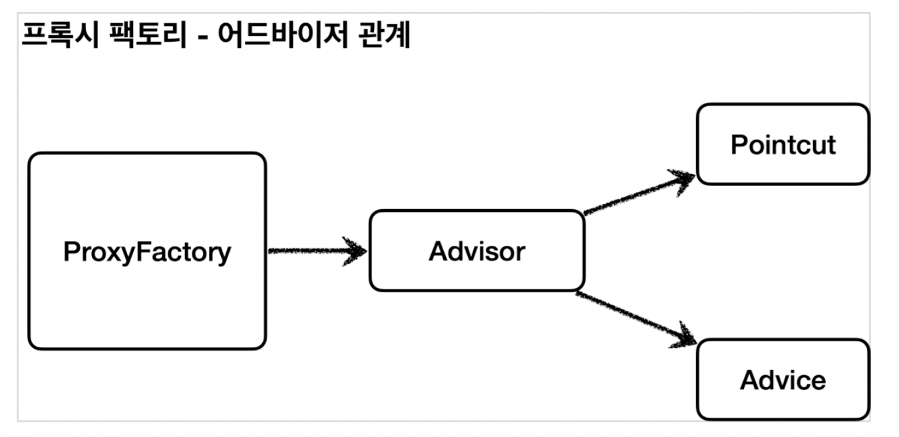
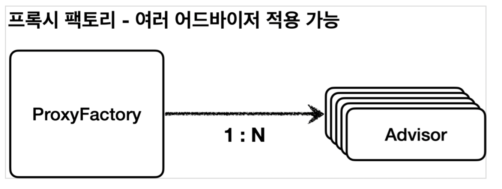
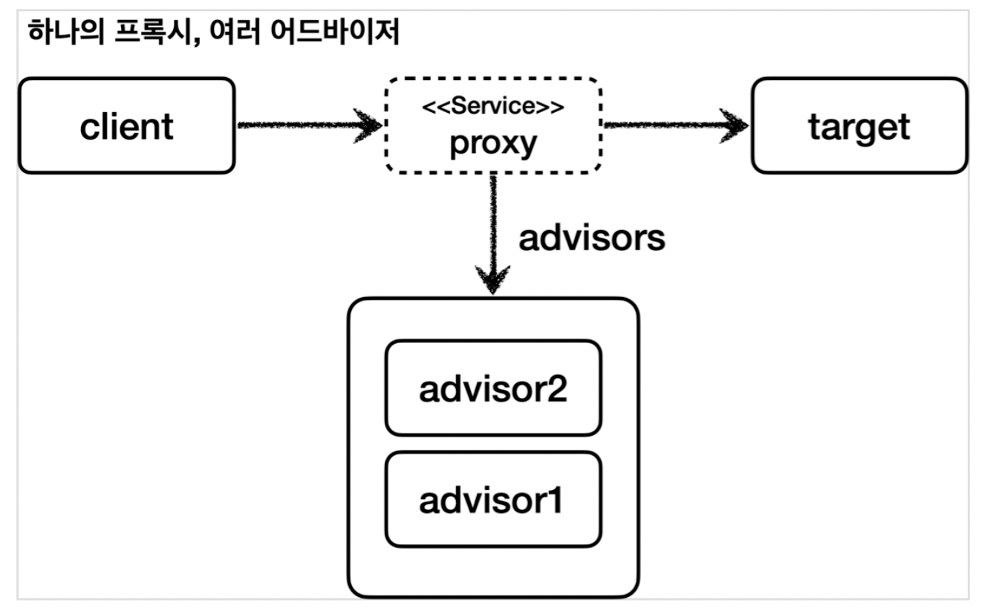
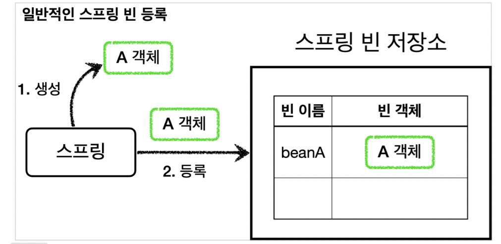
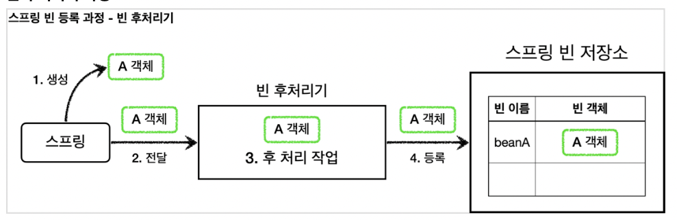
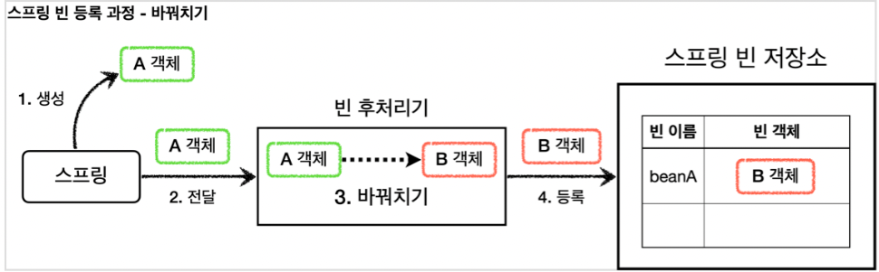

# SpringCoreAdvanced2

## 1. 프록시 패턴과 데코레이터 패턴 - 완료 일 2022.09.13
## 2. 동적 프록시 기술 - 완료 일 2022.09.18
## 3. 스프링이 지원하는 프록시 - 완료 일 2022.09.18

- 포인트컷( Pointcut ): 어디에 부가 기능을 적용할지, 어디에 부가 기능을 적용하지 않을지 판단하는 필터링 로직이다. 주로 클래스와 메서드 이름으로 필터링 한다. 이름 그대로 어떤 포인트(Point)에 기능을 적용할지 하지 않을지 잘라서(cut) 구분하는 것이다.
- 어드바이스( Advice ): 이전에 본 것 처럼 프록시가 호출하는 부가 기능이다. 단순하게 프록시 로직이라 생각하면 된다.
- 어드바이저( Advisor ): 단순하게 하나의 포인트컷과 하나의 어드바이스를 가지고 있는 것이다. 쉽게 이야기해서 포인트컷1 + 어드바이스1이다.
  정리하면 부가 기능 로직을 적용해야 하는데, 포인트컷으로 어디에? 적용할지 선택하고, 어드바이스로 어떤 로직을 적용할지 선택하는 것이다. 그리고 어디에? 어떤 로직?을 모두 알고 있는 것이 어드바이저이다.
### 쉽게 기억하기
- 조언( Advice )을 어디( Pointcut )에 할 것인가?
- 조언자( Advisor )는 어디( Pointcut )에 조언( Advice )을 해야할지 알고 있다.

### 역할과 책임
이렇게 구분한 것은 역할과 책임을 명확하게 분리한 것이다.
- 포인트컷은 대상 여부를 확인하는 필터 역할만 담당한다.
- 어드바이스는 깔끔하게 부가 기능 로직만 담당한다.
- 둘을 합치면 어드바이저가 된다. 스프링의 어드바이저는 하나의 포인트컷 + 하나의 어드바이스로 구성된다.

### 프록시 팩토리 - 오드바이저 관계

### *여러 프록시의 문제* 

이 방법이 잘못된 것은 아니지만, 프록시를 2번 생성해야 한다는 문제가 있다. 만약 적용해야 하는 어드바이저가 10개라면 10개의 프록시를 생성해야한다.

### 하나의 프록시, 여러 어드바이저
스프링은 이 문제를 해결하기 위해 하나의 프록시에 여러 어드바이저를 적용할 수 있게 만들어두었다.

## 4. 빈 후처리기

- @Bean 이나 컴포넌트 스캔으로 스프링 빈을 등록하면, 스프링은 대상 객체를 생성하고 스프링 컨테이너 내부의 빈 저장소에 등록한다. 그리고 이후에는 스프링 컨테이너를 통해 등록한 스프링 빈을 조회해서 사용하면 된다.
### *빈 후처리기 - BeanPostProcessor*
  스프링이 빈 저장소에 등록할 목적으로 생성한 객체를 빈 저장소에 등록하기 직전에 조작하고 싶다면 빈 후처리기를 사용하면 된다.
  빈 포스트 프로세서( BeanPostProcessor )는 번역하면 빈 후처리기인데, 이름 그대로 빈을 생성한 후에 무언가를 처리하는 용도로 사용한다.
### 빈 후처리기 기능
  빈 후처리기의 기능은 막강하다.
  객체를 조작할 수도 있고, 완전히 다른 객체로 바꿔치기 하는 것도 가능하다.
  ### 빈 후처리기 과정

### 빈 후처리기와 본 빈등록 과정
1. 생성: 스프링 빈 대상이 되는 객체를 생성한다. ( @Bean , 컴포넌트 스캔 모두 포함)
2. 전달: 생성된 객체를 빈 저장소에 등록하기 직전에 빈 후처리기에 전달한다.
3. 후 처리 작업: 빈 후처리기는 전달된 스프링 빈 객체를 조작하거나 다른 객체로 바뀌치기 할 수 있다. 4. 등록: 빈 후처리기는 빈을 반환한다. 전달 된 빈을 그대로 반환하면 해당 빈이 등록되고, 바꿔치기 하면 다른 객체가 빈 저장소에 등록된다.
### 다른 객체로 바꿔치는 빈 후처리기
