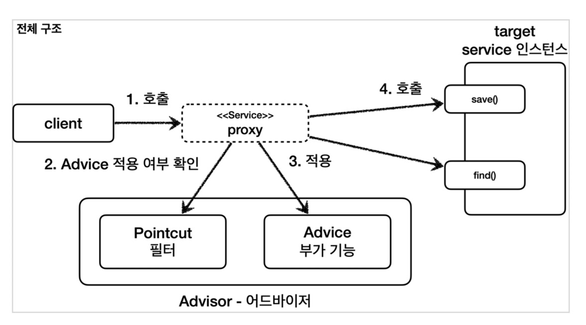

# SpringCoreAdvanced2

## 1. 프록시 패턴과 데코레이터 패턴 - 완료 일 2022.09.13
## 2. 동적 프록시 기술 - 완료 일 2022.09.18
## 3. 스프링이 지원하는 프록시 - 완료 일 2022.09.18

- 포인트컷( Pointcut ): 어디에 부가 기능을 적용할지, 어디에 부가 기능을 적용하지 않을지 판단하는 필터링 로직이다. 주로 클래스와 메서드 이름으로 필터링 한다. 이름 그대로 어떤 포인트(Point)에 기능을 적용할지 하지 않을지 잘라서(cut) 구분하는 것이다.
- 어드바이스( Advice ): 이전에 본 것 처럼 프록시가 호출하는 부가 기능이다. 단순하게 프록시 로직이라 생각하면 된다.
- 어드바이저( Advisor ): 단순하게 하나의 포인트컷과 하나의 어드바이스를 가지고 있는 것이다. 쉽게 이야기해서 포인트컷1 + 어드바이스1이다.
  정리하면 부가 기능 로직을 적용해야 하는데, 포인트컷으로 어디에? 적용할지 선택하고, 어드바이스로 어떤 로직을 적용할지 선택하는 것이다. 그리고 어디에? 어떤 로직?을 모두 알고 있는 것이 어드바이저이다.
### 쉽게 기억하기
- 조언( Advice )을 어디( Pointcut )에 할 것인가?
- 조언자( Advisor )는 어디( Pointcut )에 조언( Advice )을 해야할지 알고 있다.

### 역할과 책임
이렇게 구분한 것은 역할과 책임을 명확하게 분리한 것이다.
- 포인트컷은 대상 여부를 확인하는 필터 역할만 담당한다.
- 어드바이스는 깔끔하게 부가 기능 로직만 담당한다.
- 둘을 합치면 어드바이저가 된다. 스프링의 어드바이저는 하나의 포인트컷 + 하나의 어드바이스로 구성된다.

### 프록시 팩토리 - 오드바이저 관계

### *여러 프록시의 문제* 

이 방법이 잘못된 것은 아니지만, 프록시를 2번 생성해야 한다는 문제가 있다. 만약 적용해야 하는 어드바이저가 10개라면 10개의 프록시를 생성해야한다.

### 하나의 프록시, 여러 어드바이저
스프링은 이 문제를 해결하기 위해 하나의 프록시에 여러 어드바이저를 적용할 수 있게 만들어두었다.

## 4. 빈 후처리기 - 완료 일 2022.09.24

- @Bean 이나 컴포넌트 스캔으로 스프링 빈을 등록하면, 스프링은 대상 객체를 생성하고 스프링 컨테이너 내부의 빈 저장소에 등록한다. 그리고 이후에는 스프링 컨테이너를 통해 등록한 스프링 빈을 조회해서 사용하면 된다.
### *빈 후처리기 - BeanPostProcessor*
  스프링이 빈 저장소에 등록할 목적으로 생성한 객체를 빈 저장소에 등록하기 직전에 조작하고 싶다면 빈 후처리기를 사용하면 된다.
  빈 포스트 프로세서( BeanPostProcessor )는 번역하면 빈 후처리기인데, 이름 그대로 빈을 생성한 후에 무언가를 처리하는 용도로 사용한다.
### 빈 후처리기 기능
  빈 후처리기의 기능은 막강하다.
  객체를 조작할 수도 있고, 완전히 다른 객체로 바꿔치기 하는 것도 가능하다.
  ### 빈 후처리기 과정

### 빈 후처리기와 본 빈등록 과정
1. 생성: 스프링 빈 대상이 되는 객체를 생성한다. ( @Bean , 컴포넌트 스캔 모두 포함)
2. 전달: 생성된 객체를 빈 저장소에 등록하기 직전에 빈 후처리기에 전달한다.
3. 후 처리 작업: 빈 후처리기는 전달된 스프링 빈 객체를 조작하거나 다른 객체로 바뀌치기 할 수 있다. 4. 등록: 빈 후처리기는 빈을 반환한다. 전달 된 빈을 그대로 반환하면 해당 빈이 등록되고, 바꿔치기 하면 다른 객체가 빈 저장소에 등록된다.
### 다른 객체로 바꿔치는 빈 후처리기

## 5. @Aspect AOP - 완료 일 2022.09.25
### @Aspect 프록시 - 적용
스프링 애플리케이션에 프록시를 적용하려면 포인트컷과 어드바이스로 구성되어 있는 어드바이저
( Advisor )를 만들어서 스프링 빈으로 등록하면 된다. 그러면 나머지는 앞서 배운 자동 프록시 생성기가 모두 자동으로 처리해준다. 자동 프록시 생성기는 스프링 빈으로 등록된 어드바이저들을 찾고, 스프링 빈들에 자동으로 프록시를 적용해준다. (물론 포인트컷이 매칭되는 경우에 프록시를 생성한다.)
스프링은 *@Aspect* 애노테이션으로 매우 편리하게 포인트컷과 어드바이스로 구성되어 있는 어드바이저 생성 기능을 지원한다.
> *참고* : @Aspect 는 관점 지향 프로그래밍(AOP)을 가능하게 하는 AspectJ 프로젝트에서 제공하는 애노테이션이다. 스프링은 이것을 차용해서 프록시를 통한 AOP를 가능하게 한다. AOP와 AspectJ 관련된 자세한 내용은 다음에 설명한다. 지금은 프록시에 초점을 맞추자. 우선 이 애노테이션을 사용해서 스프링이 편리하게 프록시를 만들어준다고 생각하면 된다.
### @Aspect 프록시 - 설명
앞서 자동 프록시 생성기를 학습할 때, 자동 프록시 생성기
( AnnotationAwareAspectJAutoProxyCreator )는 Advisor 를 자동으로 찾아와서 필요한 곳에 프록시를 생성하고 적용해준다고 했다.  
자동 프록시 생성기는 여기에 추가로 하나의 역할을 더 하는데, 바로 @Aspect 를 찾아서 이것을 Advisor 로 만들어준다. 쉽게 이야기해서 지금까지 학습한 기능에 @Aspect 를 Advisor 로 변환해서 저장하는 기능도 한다.  
그래서 이름 앞에 AnnotationAware (애노테이션을 인식하는)가 붙어 있는 것이다.
### 자동 프록시 생성기는 2가지 일을 한다.
1. @Aspect 를 보고 어드바이저( Advisor )로 변환해서 저장한다. 
2. 어드바이저를 기반으로 프록시를 생성한다.
### 1. @Aspect 를 어드바이저로 변환해서 저장하는 과정

### @Aspect를 어드바이저로 변환해서 저장하는 과정
1. 실행: 스프링 애플리케이션 로딩 시점에 자동 프록시 생성기를 호출한다.
2. 모든 @Aspect 빈 조회: 자동 프록시 생성기는 스프링 컨테이너에서 @Aspect 애노테이션이 붙은 스프링 빈을 모두 조회한다.
3. 어드바이저 생성: @Aspect 어드바이저 빌더를 통해 @Aspect 애노테이션 정보를 기반으로 어드바이저를 생성한다.
4. @Aspect 기반 어드바이저 저장: 생성한 어드바이저를 @Aspect 어드바이저 빌더 내부에 저장한다.
### @Aspect 어드바이저 빌더
eanFactoryAspectJAdvisorsBuilder 클래스이다. @Aspect 의 정보를 기반으로 포인트컷, 어드바이스, 어드바이저를 생성하고 보관하는 것을 담당한다. @Aspect 의 정보를 기반으로 어드바이저를 만들고, @Aspect 어드바이저 빌더 내부 저장소에 캐시한다. 캐시에 어드바이저가 이미 만들어져 있는 경우 캐시에 저장된 어드바이저를 반환한다.
### 2. 어드바이저를 기반으로 프록시 생성

### 자동 프록시 생성기의 작동 과정
1. 생성: 스프링 빈 대상이 되는 객체를 생성한다. ( @Bean , 컴포넌트 스캔 모두 포함)
2. 전달: 생성된 객체를 빈 저장소에 등록하기 직전에 빈 후처리기에 전달한다.
   3-1. Advisor 빈 조회: 스프링 컨테이너에서 Advisor 빈을 모두 조회한다.
   3-2. @Aspect Advisor 조회: @Aspect 어드바이저 빌더 내부에 저장된 Advisor 를 모두 조회한다. 
3. 프록시 적용 대상 체크: 앞서 3-1, 3-2에서 조회한 Advisor 에 포함되어 있는 포인트컷을 사용해서 해당 객체가 프록시를 적용할 대상인지 아닌지 판단한다. 이때 객체의 클래스 정보는 물론이고, 해당 객체의 모든 메서드를 포인트컷에 하나하나 모두 매칭해본다. 그래서 조건이 하나라도 만족하면 프록시 적용 대상이 된다. 예를 들어서 메서드 하나만 포인트컷 조건에 만족해도 프록시 적용 대상이 된다.
4. 프록시 생성: 프록시 적용 대상이면 프록시를 생성하고 프록시를 반환한다. 그래서 프록시를 스프링 빈으로 등록한다. 만약 프록시 적용 대상이 아니라면 원본 객체를 반환해서 원본 객체를 스프링 빈으로 등록한다.
5. 빈 등록: 반환된 객체는 스프링 빈으로 등록된다.
### 정리
   @Aspect 를 사용해서 애노테이션 기반 프록시를 매우 편리하게 적용해보았다. 실무에서 프록시를 적용할 때는 대부분이 이 방식을 사용한다. 
   지금까지 우리가 진행한 애플리케이션 전반에 로그를 남기는 기능은 특정 기능 하나에 관심이 있는 기능이 아니다. 
   애플리케이션의 여러 기능들 사이에 걸쳐서 들어가는 관심사이다. 이것을 바로 *횡단 관심사(cross-cutting concerns)라고 한다.* 우리가 지금까지 진행한 방법이 이렇게 여러곳에 걸쳐 있는 횡단 관심사의 문제를 해결하는 방법이었다.

## 5. 스프링 AOP 개념 - 완료 일 2022.09.25